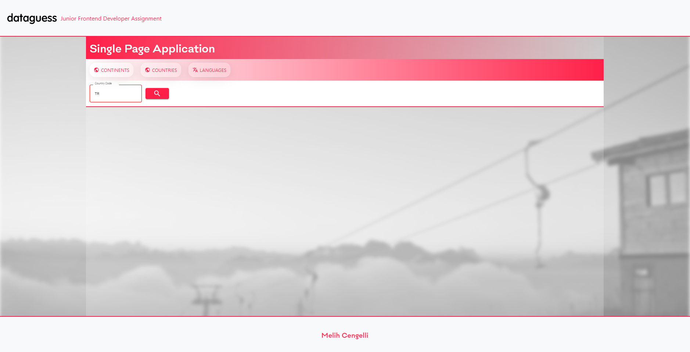
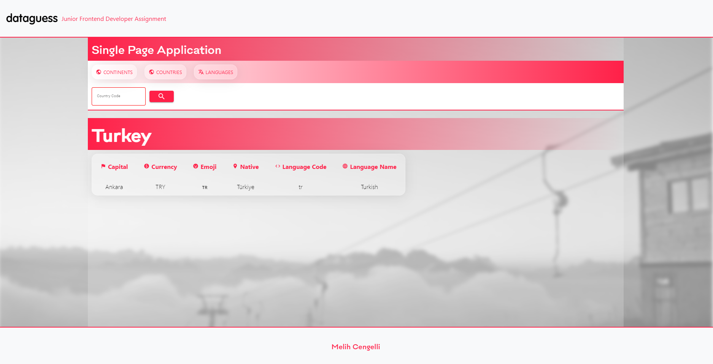
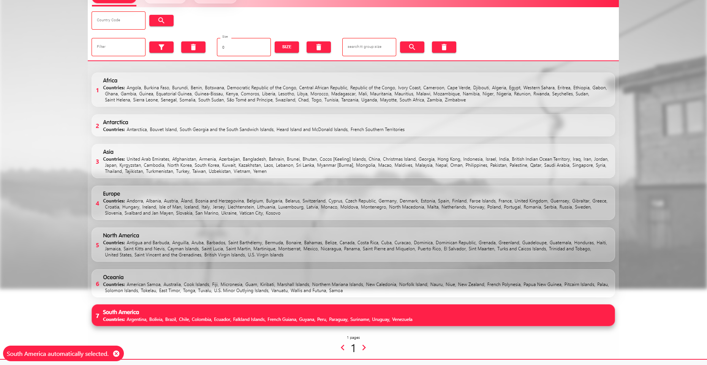
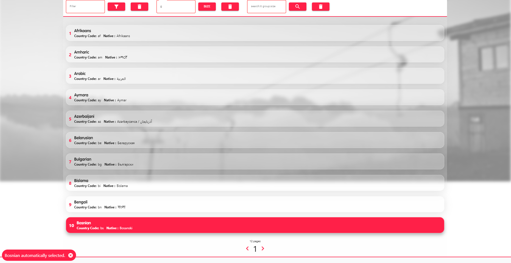
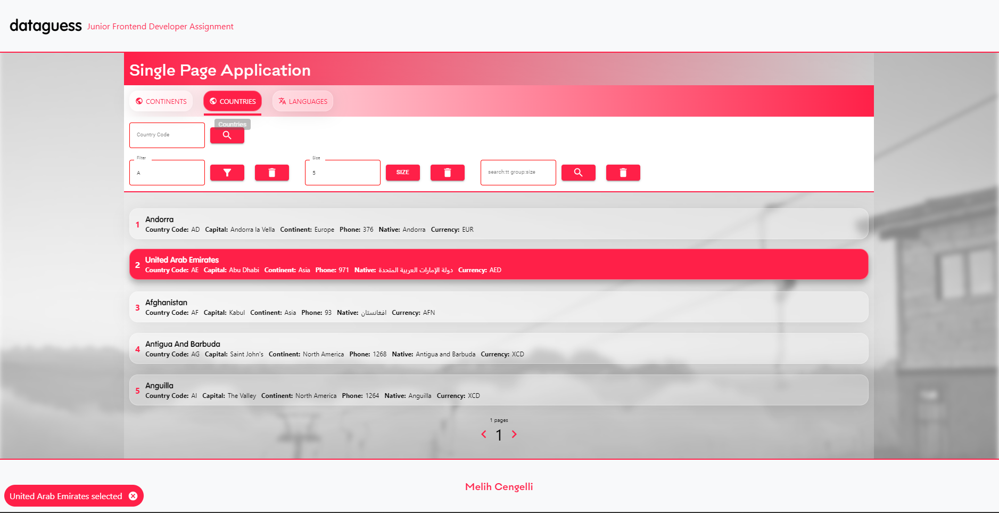

# DataGuess Junior Front End Developer Assignments

#### **Requirements**

##### :one: Requirement 1 | Situation: :white_check_mark:
Query a public GraphQL API and show the results in a list. This functionality is already provided, but feel free to change the query as you see fit.

##### :two: Requirement 2 | Situation: :white_check_mark:
The code currently uses the public Countries API. More info can be found here: https://studio.apollographql.com/public/countries/home?variant=current

##### :three: Requirement 3 | Situation: :white_check_mark:
Create a text filter above the list with which you can filter and group the results

##### :four: Requirement 4 | Situation: :white_check_mark:
E.g. if you input "search:tt group:size" it will search for the results containing "tt", and group those results by the value of a "size" field that they may have

##### :five: Requirement 5 | Situation: :white_check_mark:
The items in the list should be selectable and de-selectable by clicking on them At most one item can be selected at a time

##### :six: Requirement 6 | Situation: :white_check_mark:
The background color of the selected item should be different than the background color of unselected items

##### :seven: Requirement 7 | Situation: :white_check_mark:
The background color used for the selected item should be picked from a predefined set of colors (which you should define yourself). Make sure that when an item is selected, the color is different from the previous item that was selected

##### :eight: Requirement 8 | Situation: :white_check_mark:
After the items are loaded and after filtering, automatically select the 10th item, or the last one if the amount of items is smaller than 10 The implementation should take into account that the list can get very long.

##### :nine: Requirement 9 | Situation: :white_check_mark:
Use Typescript where possible

##### :one: :zero: Requirement 10 | Situation: :white_check_mark:
You're allowed to use open-source packages as you see fit.

##### :one: :one: Requirement 11 | Situation: :white_check_mark:
Anything not in the description is up to you.

#### **Main Page**

#### **Country Code Searching**

#### **Continent Searching**

#### **Country Searching**

#### **Language Searching**

#### **Selecting Process**

